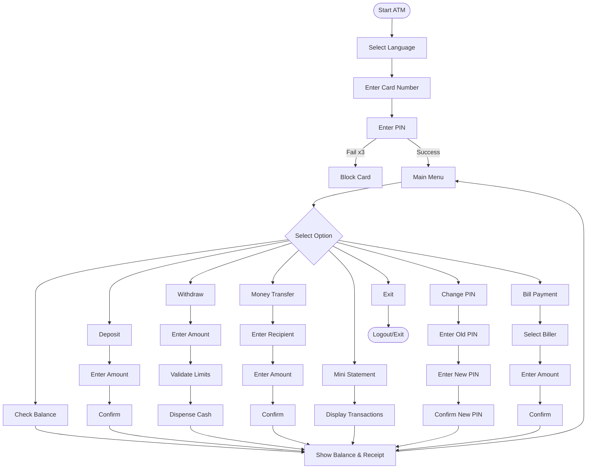
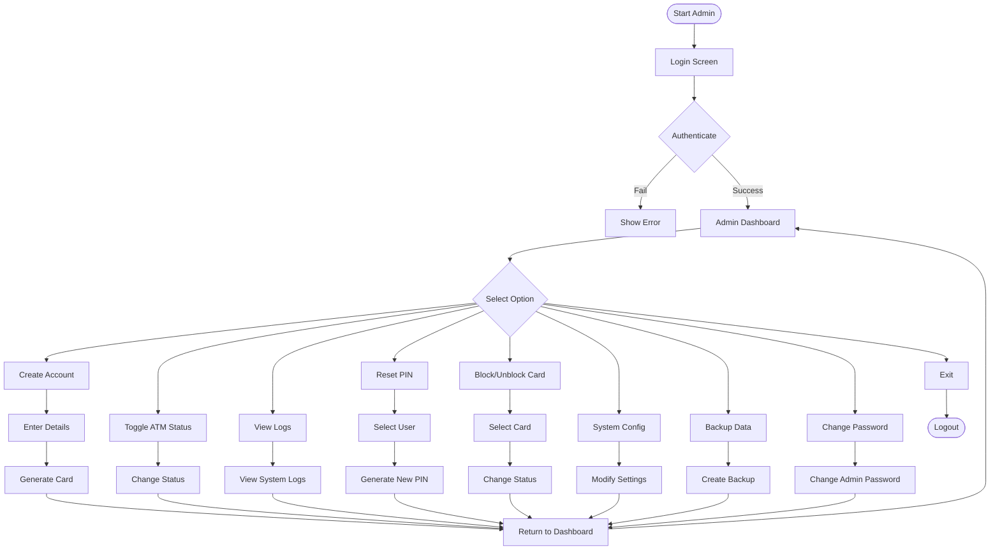
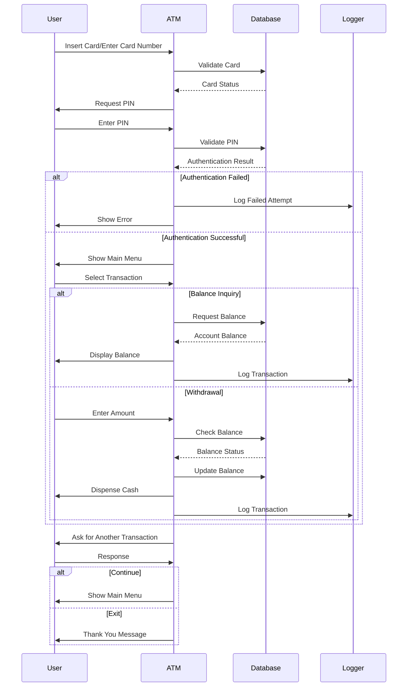

# 🏧 ATM Management System in C Language

Welcome to the **ATM Management System**! This C project simulates a real-world ATM, supporting both user and admin operations with robust security, multi-language support, and a modular codebase.

---

## ✨ Features Overview

- 🔐 **User Authentication**: 
  - Card number & PIN validation
  - Account blocking after 3 failed attempts
  - Session timeout for security
  - Card status verification (active/blocked)

- 💸 **Transactions**: 
  - Balance inquiry with detailed account information
  - Cash deposit with denomination tracking
  - Cash withdrawal with limit validation
  - Money transfer between accounts
  - Mini statement showing recent transactions
  - Bill payment services

- 🛡️ **Security Features**: 
  - PIN change functionality
  - Card blocking/unblocking
  - Transaction & error logging
  - Fraud detection algorithms
  - Encryption for sensitive data
  - Session management

- 🧑‍💼 **Admin Dashboard**: 
  - Real-time ATM status monitoring
  - Cash management by denomination
  - User account management
  - Transaction analytics and reporting
  - System configuration controls
  - Maintenance scheduling

- 🌐 **Multi-Language Support**: 
  - English, Hindi, Odia, Marathi, Gujarati
  - Easy language switching
  - Localized error messages and receipts

- 🧾 **Receipt System**: 
  - Digital receipts for all transactions
  - SMS notification simulation
  - Transaction timestamps and references
  - QR code generation for digital copies

- 📱 **Virtual ATM & UPI**: 
  - Mobile banking simulation
  - UPI transaction processing
  - Virtual card management
  - Contactless transaction support

- ⚠️ **Error Handling**: 
  - User-friendly error messages
  - Automatic recovery mechanisms
  - Detailed error logging for troubleshooting
  - Fallback options for critical operations

---

## 🗂️ Directory Structure

```
Atm-management/
├── atm_system              # Main ATM executable
├── admin_system            # Admin management executable
├── upi_system              # UPI transaction executable
├── Makefile                # Build instructions
├── README.md               # Project documentation
├── bin/                    # Compiled binaries
├── data/                   # Data files (cards, customers, config, logs)
│   ├── card.txt            # Card information database
│   ├── customer.txt        # Customer profiles
│   ├── accounting.txt      # Account balances and details
│   ├── atm_data.txt        # ATM status and cash inventory
│   ├── admin_credentials.txt # Admin login credentials
│   ├── system_config.txt   # System configuration parameters
│   └── virtual_wallet.txt  # Virtual wallet information
├── docs/                   # Documentation
├── include/                # Header files
│   ├── admin/              # Admin module headers
│   ├── atm/                # ATM module headers
│   ├── common/             # Shared functionality headers
│   └── upi_transaction/    # UPI transaction headers
├── logs/                   # Log files
├── src/                    # Source code
│   ├── admin/              # Admin module implementation
│   ├── atm/                # ATM module implementation
│   ├── common/             # Shared functionality implementation
│   ├── database/           # Database operations
│   ├── transaction/        # Transaction processing
│   └── upi_transaction/    # UPI transaction implementation
├── tests/                  # Test utilities & sample data
│   ├── init_data_files.c   # Data initialization utility
│   └── sample_receipts/    # Sample receipt templates
└── ...
```

---

## 🧭 System Architecture

### User Flow



### Admin Flow



---

## 🗒️ Menu & Submenu Options

### 👤 User Main Menu

| Option | Description                | Sub-options/Prompts                | Limits/Notes                     |
|--------|----------------------------|------------------------------------|----------------------------------|
| 1️⃣    | Check Balance              | Shows account balance, prints receipt | No limit on balance checks      |
| 2️⃣    | Deposit                    | Enter amount, confirm, receipt     | Max: ₹1,00,000 per transaction   |
| 3️⃣    | Withdraw                   | Enter amount, check limits, receipt| Max: ₹25,000 per transaction     |
| 4️⃣    | Money Transfer             | Enter recipient, amount, confirm   | Max: ₹50,000 per transaction     |
| 5️⃣    | Mini Statement             | Shows last 10 transactions         | Limited to recent transactions   |
| 6️⃣    | Change PIN                 | Enter old/new PIN, confirm         | PIN must be 4 digits             |
| 7️⃣    | Bill Payment               | Select biller, enter amount        | Various billers supported        |
| 8️⃣    | Exit                       | Logout                             | Session ends                     |

### 👨‍💼 Admin Main Menu

| Option | Description                | Sub-options/Prompts                | Access Level                     |
|--------|----------------------------|------------------------------------|----------------------------------|
| 1️⃣    | Create Account             | Enter customer details, generate card | UserAdmin, SuperAdmin         |
| 2️⃣    | Toggle ATM Status          | Online/Offline, Maintenance mode   | ATMAdmin, SuperAdmin            |
| 3️⃣    | View System Logs           | Transaction logs, error logs, audit | All admin levels                |
| 4️⃣    | Reset PIN                  | Select user, generate new PIN      | UserAdmin, SuperAdmin           |
| 5️⃣    | Block/Unblock Card         | Select card, change status         | UserAdmin, SuperAdmin           |
| 6️⃣    | System Configuration       | Edit limits, language, timeout     | SuperAdmin only                 |
| 7️⃣    | Backup System Data         | Create backup of all data files    | SuperAdmin only                 |
| 8️⃣    | Change Password            | Change admin credentials           | All admin levels (own password) |
| 9️⃣    | Exit                       | Logout                             | Session ends                    |

---

## ⚠️ Common Errors & Solutions

| Error Code | Error Message           | Cause                        | Solution                           |
|------------|-------------------------|------------------------------|-----------------------------------|
| E001       | Invalid card number     | Card not found in system     | Check card, contact bank          |
| E002       | Incorrect PIN           | Wrong PIN entered            | Retry, reset PIN after 3 failures |
| E003       | Insufficient funds      | Not enough balance           | Deposit or lower withdrawal amount|
| E004       | Daily limit exceeded    | Over daily transaction limit | Try again next day                |
| E005       | Card is blocked         | Too many failed PINs         | Contact bank for unblocking       |
| E006       | ATM out of service      | Maintenance mode             | Try another ATM                   |
| E007       | Session timeout         | Inactivity                   | Login again                       |
| E008       | Invalid amount          | Amount not in valid range    | Enter valid amount                |
| E009       | Recipient not found     | Invalid account for transfer | Check recipient details           |
| E010       | System error            | Internal processing error    | Contact support with error code   |

---

## 🚀 Getting Started

### System Requirements
- GCC Compiler (version 7.0 or higher)
- Make utility
- 50MB disk space
- Linux/Unix environment (Windows with MinGW also supported)

### Installation Steps

1. Clone the repository:
   ```
   git clone https://github.com/yourusername/atm-management.git
   cd atm-management
   ```

2. Initialize test data (optional but recommended for first run):
   ```
   cd tests
   gcc init_data_files.c -o init_data
   ./init_data
   cd ..
   ```

3. Build the system:
   ```
   make clean
   make all
   ```

4. Run the ATM system:
   ```
   ./atm_system
   ```

5. For admin access:
   ```
   ./admin_system
   ```

6. For UPI transactions:
   ```
   ./upi_system
   ```

### Test Credentials

#### User Accounts
| Card Number        | PIN  | Customer Name   | Balance    |
|--------------------|------|-----------------|------------|
| 4287-8130-5602-8804| 1234 | John Doe        | ₹25,000.00 |
| 5126-7352-8940-1234| 5678 | Jane Smith      | ₹35,750.50 |
| 6011-2345-6789-0123| 9012 | Robert Johnson  | ₹12,340.75 |

#### Admin Accounts
| Username     | Password | Role       | Access Level |
|--------------|----------|------------|--------------|
| admin@123    | admin123 | SuperAdmin | Full access  |
| atm.admin@12 | atm12345 | ATMAdmin   | ATM management only |
| UserAdmin@12 | user12345| UserAdmin  | User management only |

---

## 🖥️ Sample Output

### ATM Main Menu
```
===== WELCOME TO ATM MANAGEMENT SYSTEM =====
Language: English

Please insert your card or enter card number:
> 4287-8130-5602-8804

Enter PIN:
> ****

===== MAIN MENU =====
Welcome, John Doe!
1. Check Balance
2. Deposit
3. Withdraw
4. Money Transfer
5. Mini Statement
6. Change PIN
7. Bill Payment
8. Exit
====================
Enter your choice: _
```

### Balance Check Result
```
===== BALANCE INQUIRY =====
Account Number: 11463834400
Account Holder: John Doe
Available Balance: ₹25,000.00
Ledger Balance: ₹25,000.00

Would you like a receipt? (Y/N): Y

Printing receipt...
Receipt sent to your registered mobile number.
===========================
Press any key to continue...
```

### Admin Dashboard
```
===== ADMIN DASHBOARD =====
Welcome, SuperAdmin!

ATM STATUS SUMMARY:
- Online ATMs: 5
- Offline ATMs: 1
- Low Cash Alert: ATM002, ATM004
- Maintenance Mode: None

RECENT ACTIVITIES:
- 15 transactions in last hour
- 2 failed login attempts
- 0 suspicious activities

OPTIONS:
1. Create New Customer Account
2. Toggle ATM/Banking Service Status
3. View System Logs
4. Regenerate Card PIN
5. Block/Unblock Card
6. Manage System Configuration
7. Back Up System Data
8. Change Admin Password
9. Exit

Enter choice: _
```

---

## 🔄 Transaction Flow



---

## 🎉 Thank You!

Thank you for choosing our **ATM Management System**! This project demonstrates comprehensive banking operations with robust security features. We welcome feedback and contributions to enhance this system further.

*Developed with ❤️ in India*
