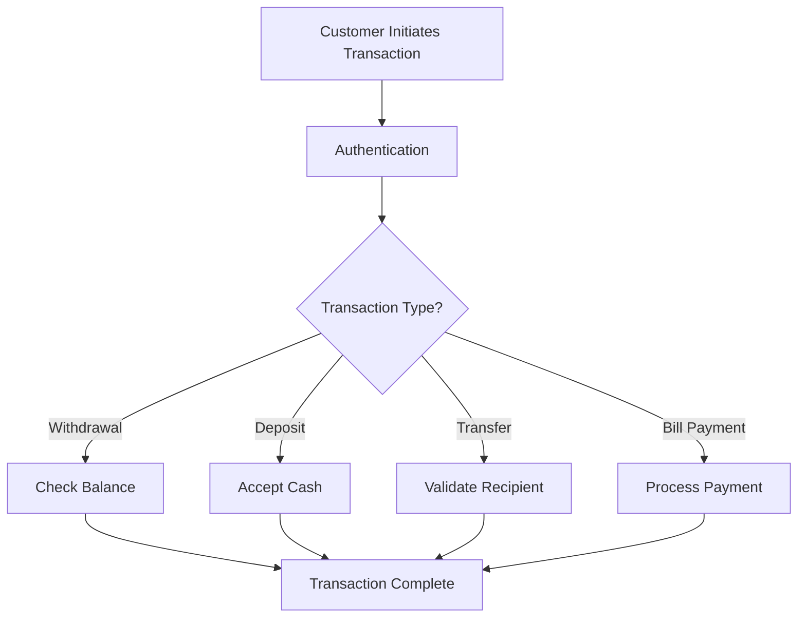

# ATM Management System 🚀

## Overview 🌟
This project is a comprehensive ATM Management System with a clear separation between frontend and backend components. The backend is implemented in C and SQL for core ATM operations, while the frontend consists of:
- **CLI Interface** 🖥️
- **Web Interface** 🌐 (HTML, CSS, PHP)
- **Mobile Application** 📱 (Flutter)

## Build Information 🛠️
This project has been reorganized to ensure proper code separation between frontend and backend components.

For detailed build instructions, see:
- [Build Guide](./BUILD_GUIDE.md) - Step-by-step build instructions
- [Project Organization](./PROJECT_ORGANIZATION.md) - Information about code organization

### Quick Start
```bash
# Standard build with MySQL
mingw32-make all

# MySQL-less build
mingw32-make all CFLAGS+="-DNO_MYSQL"

# Verify code organization
mingw32-make verify_organization
```

## Project Structure 🗂️
```
/app/                    # Core application package
│   ├── bin/             # CLI entry points, management scripts
│   ├── lib/             # Shared modules, utilities
│   ├── config/          # Configuration files (JSON/YAML)
│   ├── logs/            # Application logs
│   └── models/          # Data models
├── admin_panel/         # Administrative interface
├── database/            # Database related files
│   ├── migrations/      # Database migration scripts
│   ├── backups/         # Database backups
│   └── logs/            # Database logs
├── transactions/        # Transaction processing
│   ├── inbound/         # Incoming transaction files
│   └── outbound/        # Outgoing transaction files
├── integration/         # External system integrations
├── security/            # Security components
│   └── middleware/      # Security middlewares
├── monitoring/          # System monitoring
├── scripts/             # Maintenance and deployment
├── tests/               # Test suites
├── gui/                 # User interfaces
├── upi/                 # UPI payment services
└── utils/               # Utilities
```

## DAO Pattern Implementation 🧩
The project now uses a Database Access Object (DAO) pattern to abstract database operations. This provides:

- **Storage Agnosticism**: Same code works with both MySQL and file-based storage
- **Improved Testability**: Easy to mock database interactions for testing
- **Enhanced Maintainability**: Database operations centralized in one layer
- **Better Performance**: Optimized with connection pooling and O(1) operations

### DAO Structure
```
include/common/database/
├── dao_interface.h           # The DAO interface definition
├── db_unified_config.h       # Unified database configuration

backend/database/
├── dao_factory.c             # Factory to create appropriate DAO
├── file_based_dao.c          # File-based implementation
├── mysql_dao.c               # MySQL implementation
```

### Architecture Diagram
```
+------------------+     +-------------------+
| Business Logic   |     | Transaction       |
| (ATM Operations) +---->+ Manager           |
+------------------+     +-------------------+
                              |
                              | Uses
                              v
+---------------------------+-----------------+
|         DAO Interface     | getDAO()        |
+---------------------------+-----------------+
                |                |
        +-------+-------+        |
        |               |        |
+-------v-------+ +-----v-------+|
| File-Based    | | MySQL       ||
| DAO           | | DAO         ||
+---------------+ +-------------+|
```

### Performance Optimizations

1. **O(1) Access Time**: File-based DAO uses indexed access instead of linear search
2. **Connection Pooling**: MySQL DAO implements connection pooling to reduce overhead
3. **Atomic Updates**: File operations use temporary files for atomic updates
4. **Caching**: Frequently accessed data is cached to reduce I/O operations
5. **Optimized Queries**: MySQL operations use prepared statements and optimized queries

For complete details, see the [DAO Implementation Report](./docs/dao_implementation_report.md).
├── db_unified_config.h       # Unified database configuration

backend/database/
├── dao_factory.c             # Factory to create appropriate DAO implementation
├── file_based_dao.c          # File-based storage implementation
├── mysql_dao.c               # MySQL storage implementation

backend/c_backend/src/atm/transaction/
├── transaction_manager_dao.c # Transaction manager using DAO pattern
```

### DAO Interface
The DAO interface provides a consistent API for database operations:

```c
typedef struct {
    // Card operations
    bool (*doesCardExist)(int cardNumber);
    bool (*isCardActive)(int cardNumber);
    bool (*validateCard)(int cardNumber, int pin);
    
    // Account operations
    float (*fetchBalance)(int cardNumber);
    bool (*updateBalance)(int cardNumber, float newBalance);
    
    // Transaction operations
    bool (*logTransaction)(int cardNumber, const char* transactionType, float amount, bool success);
    bool (*getMiniStatement)(int cardNumber, Transaction* transactions, int maxTransactions, int* count);
    
    // ... and more operations
} DatabaseAccessObject;
```

### Using the DAO Pattern

Transaction managers and other modules can now interact with the database through the DAO interface:

```c
DatabaseAccessObject* dao = getDAO();  // Get appropriate DAO implementation
float balance = dao->fetchBalance(cardNumber);  // Same API, different storage backends
```

### Testing the DAO Implementation

A comprehensive test suite is available to verify DAO functionality:

```bash
# Build the DAO test
mingw32-make dao_test

# Run the DAO test
bin/test_dao_implementation.exe
```

### DAO Pattern Architecture Diagram

```
+-------------------+       +-----------------+      +------------------+
| Transaction       |       | Admin           |      | Account          |
| Manager           |       | Operations      |      | Management       |
+-------------------+       +-----------------+      +------------------+
          |                         |                        |
          v                         v                        v
+------------------------------------------------------------------+
|                                                                  |
|               Database Access Object (DAO) Interface Layer       |
|                                                                  |
+------------------------------------------------------------------+
          |                         |                        |
          v                         v                        v
+-------------------+       +-----------------+      +------------------+
| MySQL DAO         |       | File-based DAO  | <--> | Factory Pattern  |
| Implementation    |       | Implementation  |      | getDAO()         |
+-------------------+       +-----------------+      +------------------+
          |                         |
          v                         v
+-------------------+       +-----------------+
| MySQL             |       | Filesystem      |
| Database          |       | Storage         |
+-------------------+       +-----------------+
```

### Performance Improvements

The DAO implementation includes several performance optimizations:

1. **O(1) Access Time**: File-based DAO uses indexed access instead of linear search
2. **Connection Pooling**: MySQL DAO implements connection pooling to reduce overhead
3. **Atomic Updates**: File operations use temporary files for atomic updates
4. **Caching**: Frequently accessed data is cached to reduce I/O operations
5. **Optimized Queries**: MySQL operations use prepared statements and optimized queries
├── db_unified_config.h # Shared database configuration
└── db_config.h       # Compatibility layer

backend/database/
├── mysql_dao.c      # MySQL implementation of DAO interface
├── file_based_dao.c # File-based implementation of DAO interface
└── dao_factory.c    # Factory for creating appropriate DAO instances
```

### Using the DAO Pattern
```c
// Get the DAO instance
DatabaseAccessObject* dao = getDAO();

// Use DAO methods instead of direct database calls
if (dao->doesCardExist(cardNumber)) {
    float balance = dao->fetchBalance(cardNumber);
    // Process balance...
}
```

Example implementations are provided in `examples/transaction_processor_dao.c`

## Features ✨
- **ATM Operations** 🏧:
  - Cash withdrawals 💵
  - Cash deposits 🏦
  - Fund transfers 🔄
  - Balance inquiries 📊
  - Mini statements 📜
  - PIN changes 🔑
  - Bill payments 🧾
- **Admin Management** 👩‍💼:
  - User management 👥
  - ATM management 🏧
  - Transaction monitoring 📈
  - System configuration ⚙️
- **Web Interface** 🌐:
  - Customer portal 🛠️
  - Admin dashboard 📊
  - Transaction history 📜
  - Account management 🏦
- **Mobile Application** 📱:
  - Mobile banking 📲
  - UPI transactions 🔄
  - Account management 🏦
  - Transaction history 📜

## Transaction Flowchart 📊


## Setup Instructions 🛠️

### Prerequisites 📋
- MySQL Server (version 5.7 or higher)
- MySQL C Connector (libmysqlclient-dev)
- GCC Compiler
- PHP 7.4 or higher
- Flutter SDK
- Web server (Apache/Nginx)

### Database Setup 🗄️
1. **MySQL Configuration**:
   Use the provided setup scripts to check for MySQL and configure the database:
   ```bash
   # For Linux
   ./setup_mysql.sh
   
   # For Windows
   setup_mysql.bat
   ```
   
   These scripts will:
   - Check if MySQL is installed and running
   - Create the database and required user
   - Import the schema if available
   - Offer build options with or without MySQL
   
2. **Manual Setup**:
   If you prefer manual setup, use these scripts:
   ```bash
   # For Linux
   ./initialize_db.sh
   
   # For Windows
   initialize_db.bat
   ```

### C Backend Setup ⚙️
1. Configure database connection:
   Edit `backend/c_backend/include/common/db_config.h` with your MySQL credentials.
2. Compile the C backend:
   ```bash
   make clean
   make
   ```

### Web Backend Setup 🌐
1. Configure database connection:
   Edit `backend/web_backend/config/config.php` with your MySQL credentials.
2. Set up the web server:
   Configure your web server to point to the `frontend/web` directory.

### Mobile App Setup 📱
1. Set up Flutter:
   ```bash
   cd frontend/mobile/flutter_app
   flutter pub get
   ```
2. Configure the app:
   Edit `frontend/mobile/flutter_app/lib/config/config.dart` with your API endpoints.

## Running the Application 🚀
- **Database Setup**:
  ```bash
  # Verify MySQL is running
  # For Windows
  Get-Service -Name *mysql*
  
  # Build with MySQL support
  mingw32-make all
  
  # Or build without MySQL (uses stub implementation)
  mingw32-make all CFLAGS+="-DNO_MYSQL"
  ```

- **C Backend**:
  ```bash
  cd bin
  ./atm_system
  ./admin_system
  ./upi_system
  ```
- **CLI Frontend**:
  ```bash
  cd bin
  ./atm_cli
  ```
- **Web Frontend**:
  Access through your web server, e.g., http://localhost/atm-management/
- **Mobile App**:
  ```bash
  cd frontend/mobile/flutter_app
  flutter run
  ```

## Security Considerations 🔒
- All passwords are securely hashed
- PIN numbers are encrypted
- Transactions are logged for audit purposes
- Session management for web and mobile interfaces
- Input validation to prevent SQL injection

## Future Enhancements 🚀
- Multi-factor authentication 🔐
- SMS notifications for transactions 📲
- Advanced reporting and analytics 📊
- Integration with other banking systems 🔄
- Biometric authentication 🧬

## Contributors 🤝
- [Your Name]

## License 📜
[Your License]


# Core Banking System (CBS) Project 🚀

## Overview 🌟
This project is a comprehensive Core Banking System with a clear separation of components. The system includes:
- **Core Banking Functionality** 🏦
- **CLI Interface** 🖥️
- **Web Interface** 🌐 (HTML, CSS, PHP)
- **Mobile Application** 📱 (Flutter)

## Documentation 📚
For comprehensive project documentation, see:
- [Documentation Index](./docs/README.md) - Starting point for all documentation
- [Project Documentation](./docs/CBS_PROJECT_DOCUMENTATION.md) - Complete system overview
- [Function Reference](./docs/CBS_FUNCTION_REFERENCE.md) - Detailed API documentation
- [Logging Guide](./docs/CBS_LOGGING_GUIDE.md) - Guide to logging system usage
- [Build Guide](./docs/CBS_BUILD_GUIDE.md) - Step-by-step build instructions
- [Testing Plan](./docs/CBS_TESTING_PLAN.md) - Comprehensive testing strategy
- [Reorganization Guide](./REORGANIZATION_GUIDE.md) - Guide to the new directory structure

## Build Information 🛠️
This project has been reorganized to ensure proper separation of components.

### Quick Start
```bash
# Standard build with MySQL
make all

# MySQL-less build
make all CFLAGS+="-DNO_MYSQL"

# Verify code organization
make verify_organization
```

## Project Structure 🗂️
```
/app/                    # Core application package
│   ├── bin/             # CLI entry points, management scripts
│   ├── lib/             # Shared modules, utilities
│   ├── config/          # Configuration files (JSON/YAML)
│   ├── logs/            # Application logs
│   └── models/          # Data models
├── admin_panel/         # Administrative interface
├── database/            # Database related files
│   ├── migrations/      # Database migration scripts
│   ├── backups/         # Database backups
│   └── logs/            # Database logs
├── transactions/        # Transaction processing
│   ├── inbound/         # Incoming transaction files
│   └── outbound/        # Outgoing transaction files
├── integration/         # External system integrations
├── security/            # Security components
│   └── middleware/      # Security middlewares
├── monitoring/          # System monitoring
├── scripts/             # Maintenance and deployment
├── tests/               # Test suites
├── gui/                 # User interfaces
├── upi/                 # UPI payment services
└── utils/               # Utilities
```

## DAO Pattern Implementation 🧩
The project uses a Database Access Object (DAO) pattern to abstract database operations. This provides:

- **Storage Agnosticism**: Same code works with both MySQL and file-based storage
- **Improved Testability**: Easy to mock database interactions for testing
- **Enhanced Maintainability**: Database operations centralized in one layer
- **Better Performance**: Optimized with connection pooling and O(1) operations

## Migration Process 🔄
The project has undergone a significant reorganization to improve its structure and maintainability. The migration process included:

1. Creating a detailed migration plan
2. Executing the migration using automated scripts
3. Verifying the migration with a comprehensive verification script
4. Updating the build system to work with the new structure

For more details on the reorganization, see the [Reorganization Guide](./REORGANIZATION_GUIDE.md).

## Features 🔥

### Core Banking Features
- Account management
- Transaction processing
- Bill payments
- Funds transfers
- ATM services
- UPI payments
- Loan management
- Customer management

### Security Features
- Secure authentication
- Transaction encryption
- Audit logging
- Role-based access control
- Secure password management

### Administrative Features
- User management
- System configuration
- Reporting and analytics
- Transaction monitoring
- Account administration

## Contributing 🤝
Contributions are welcome! Please see [CONTRIBUTING.md](./CONTRIBUTING.md) for guidelines.

## License 📝
This project is licensed under the MIT License - see the [LICENSE](./LICENSE) file for details.
