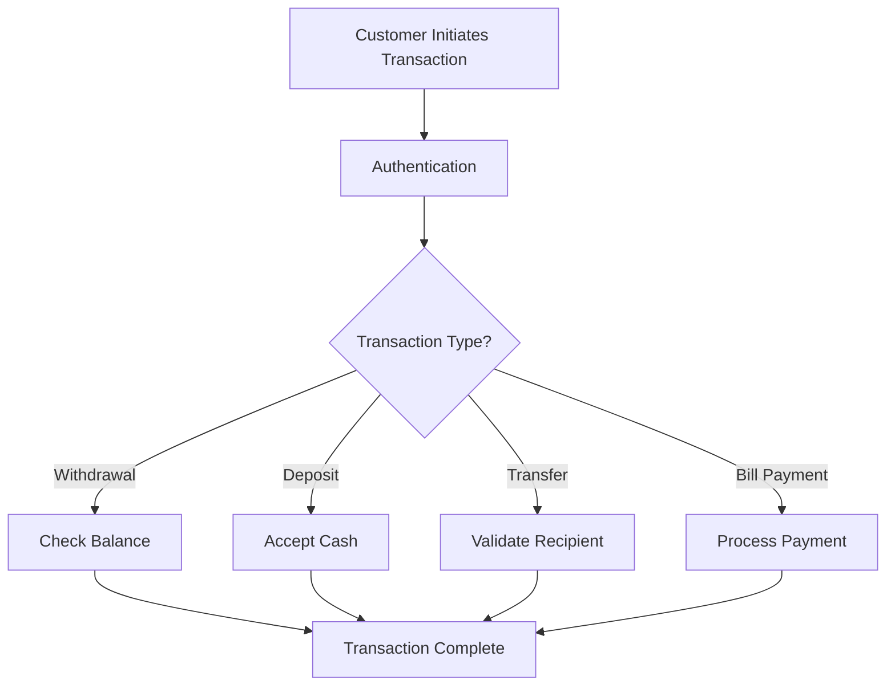

# ATM Management System 🚀

## Overview 🌟
This project is a comprehensive ATM Management System with a clear separation between frontend and backend components. The backend is implemented in C and SQL for core ATM operations, while the frontend consists of:
- **CLI Interface** 🖥️
- **Web Interface** 🌐 (HTML, CSS, PHP)
- **Mobile Application** 📱 (Flutter)

## Project Structure 🗂️
```
Atm-management/
├── backend/          # Backend implementation
├── frontend/         # Frontend interfaces
├── setup/            # Setup scripts and database schema
├── data/             # Data files
├── logs/             # Log files
├── docs/             # Documentation
└── Makefile          # Build configuration
```

## Features ✨
- **ATM Operations** 🏧:
  - Cash withdrawals 💵
  - Cash deposits 🏦
  - Fund transfers 🔄
  - Balance inquiries 📊
  - Mini statements 📜
  - PIN changes 🔑
  - Bill payments 🧾
- **Admin Management** 👩‍💼:
  - User management 👥
  - ATM management 🏧
  - Transaction monitoring 📈
  - System configuration ⚙️
- **Web Interface** 🌐:
  - Customer portal 🛠️
  - Admin dashboard 📊
  - Transaction history 📜
  - Account management 🏦
- **Mobile Application** 📱:
  - Mobile banking 📲
  - UPI transactions 🔄
  - Account management 🏦
  - Transaction history 📜

## Transaction Flowchart 📊


## Setup Instructions 🛠️

### Prerequisites 📋
- MySQL Server (version 5.7 or higher)
- MySQL C Connector (libmysqlclient-dev)
- GCC Compiler
- PHP 7.4 or higher
- Flutter SDK
- Web server (Apache/Nginx)

### Database Setup 🗄️
1. **For Linux**:
   ```bash
   ./initialize_db.sh
   ```
2. **For Windows**:
   ```cmd
   initialize_db.bat
   ```

### C Backend Setup ⚙️
1. Configure database connection:
   Edit `backend/c_backend/include/common/db_config.h` with your MySQL credentials.
2. Compile the C backend:
   ```bash
   make clean
   make
   ```

### Web Backend Setup 🌐
1. Configure database connection:
   Edit `backend/web_backend/config/config.php` with your MySQL credentials.
2. Set up the web server:
   Configure your web server to point to the `frontend/web` directory.

### Mobile App Setup 📱
1. Set up Flutter:
   ```bash
   cd frontend/mobile/flutter_app
   flutter pub get
   ```
2. Configure the app:
   Edit `frontend/mobile/flutter_app/lib/config/config.dart` with your API endpoints.

## Running the Application 🚀
- **C Backend**:
  ```bash
  cd bin
  ./atm_system
  ./admin_system
  ./upi_system
  ```
- **CLI Frontend**:
  ```bash
  cd bin
  ./atm_cli
  ```
- **Web Frontend**:
  Access through your web server, e.g., http://localhost/atm-management/
- **Mobile App**:
  ```bash
  cd frontend/mobile/flutter_app
  flutter run
  ```

## Security Considerations 🔒
- All passwords are securely hashed
- PIN numbers are encrypted
- Transactions are logged for audit purposes
- Session management for web and mobile interfaces
- Input validation to prevent SQL injection

## Future Enhancements 🚀
- Multi-factor authentication 🔐
- SMS notifications for transactions 📲
- Advanced reporting and analytics 📊
- Integration with other banking systems 🔄
- Biometric authentication 🧬

## Contributors 🤝
- [Your Name]

## License 📜
[Your License]
