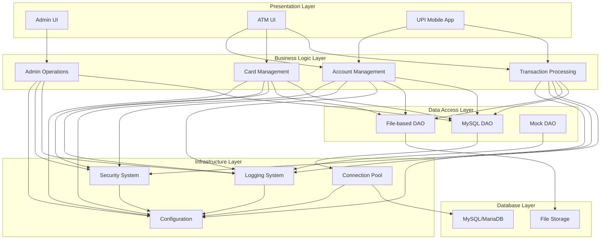

```mermaid
graph TB
    subgraph "Presentation Layer"
        A[Admin UI]
        B[ATM UI]
        C[UPI Mobile App]
    end
    
    subgraph "Business Logic Layer"
        D[Transaction Processing]
        E[Card Management]
        F[Account Management]
        G[Admin Operations]
    end
    
    subgraph "Data Access Layer"
        H[MySQL DAO]
        I[File-based DAO]
        J[Mock DAO]
    end
    
    subgraph "Infrastructure Layer"
        K[Logging System]
        L[Security System]
        M[Configuration]
        N[Connection Pool]
    end
    
    subgraph "Database Layer"
        O[MySQL/MariaDB]
        P[File Storage]
    end
    
    %% Connections
    A --> G
    B --> D
    B --> E
    B --> F
    C --> D
    C --> F
    
    D --> H
    D --> I
    D --> K
    E --> H
    E --> I
    E --> K
    F --> H
    F --> I
    F --> K
    G --> H
    G --> K
    
    H --> N
    N --> O
    I --> P
    J --> K
    
    %% Security connections
    D --> L
    E --> L
    F --> L
    G --> L
    
    %% Config connections
    D --> M
    E --> M
    F --> M
    G --> M
    K --> M
    L --> M
    N --> M
```
